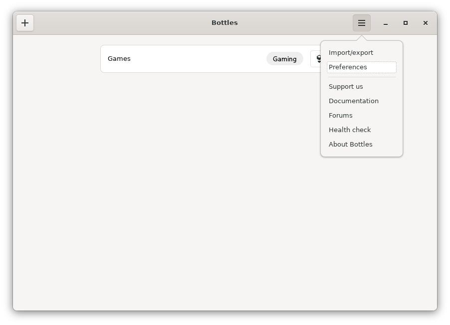
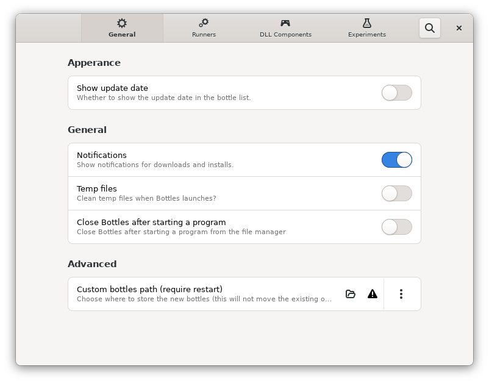
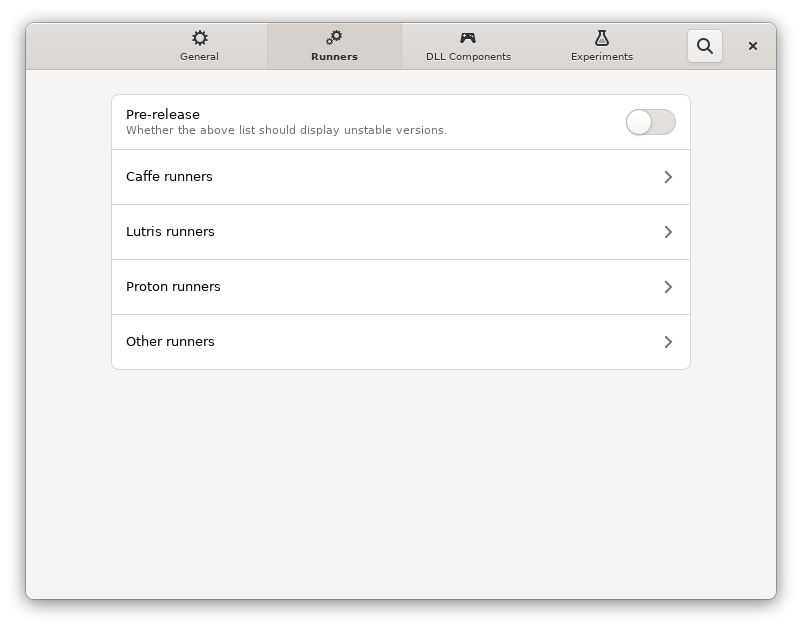
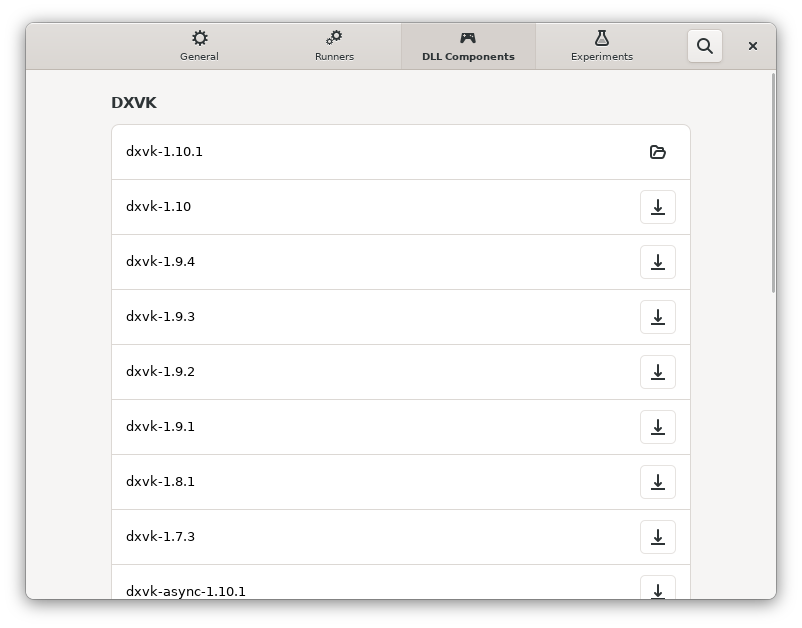

# App preferences

To access Bottles preferences, just press the menu button and select **Preferences**.

Preferences shows four sections:

* General
* Runners
* DLL Components
* Experiments

### General

In the **General** section you can configure the Bottles appearance and general settings.

Appearance settings:

* Toggle dark mode \(turn off the lights\)
* Show update date \(this will toggle the last edit date in the bottles list\)

General settings:

* Notifications \(choose if Bottles should display notifications in your desktop\)
* Temp files \(toggle to prune the temp directory on Bottles start, this will reduce the disk used by Bottles but also forcing re-download dependencies when installing in new bottles\)
* Close Bottles after starting a program \(this works only when Bottles was started from the file manager or using the CLI\)

Advanced settings:

* Custom bottles path \(specifies the directory that Bottles should use to search for existing bottles and create new ones\)

### Runners

In the **Runners** section you can list, browse and install new runners which can be used to create new bottles. [Read more about Runners](../components/runners.md).

### DLL Components

From the **DLL Components** section you can list, browse and install new versions of DXVK, VKD3D, DXVK-NVAPI and LatencyFleX. [Read more about DXVK](../components/dxvk.md).

### Experiments

The **Experiments** sections allows you to enable functions that are currently under active development and may work unstable. Use them at your own risk.

