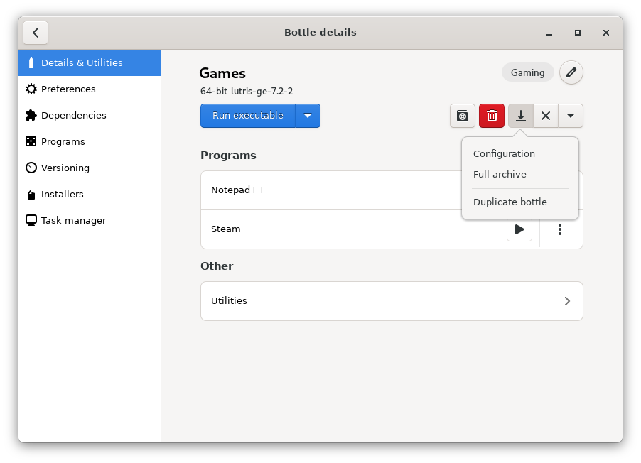

# Backups & Duplicate

### How to backup

To backup your bottle, just go to the bottle details view and press the button  at the top right of your bottle, then select the backup method you prefer.

### Backup types

In Bottles you can export your bottles with ease and in multiple ways:

* Config backup
* Full backup
* Duplicate

The **config backup** ("Configuration" option) make a copy of your bottle configuration (the `bottle.yml` file in the bottle root), this can be provided to other users to replicate your bottle configuration or attached to a report when you are facing problems.

The **full backup** ("Full archive" option) make an archive with a full copy of your bottle directory (comprehensive of configuration and files) and let you store it wherever you want.


The full backup of a bottle includes all the personal files inside it. Be careful if you want to share it with other people or replicate it on computers that can be used by other people.


You can also **duplicate** a bottle ("Duplicate bottle" option) with a different name. This can also be used to create bottles with a  template, so make a new bottle with tweaked configuration and some dependencies, then duplicate to use the same environment in a new bottle.

### Import backups

You can also import the backup of a bottle, using our [Importer](./import-from-other-managers.md).
