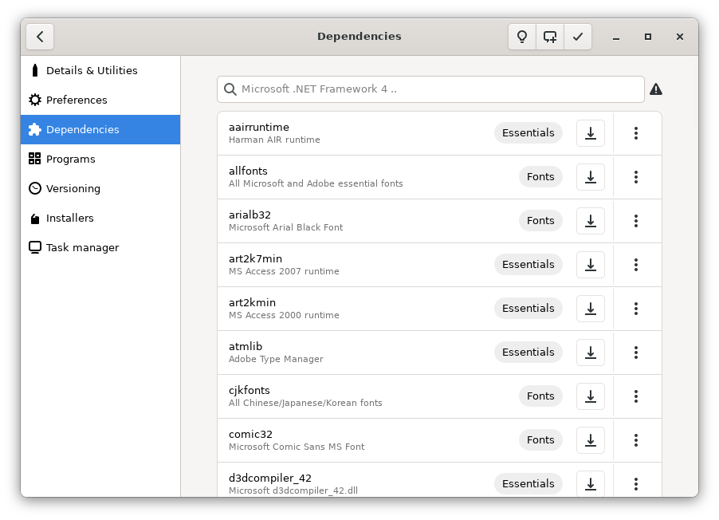
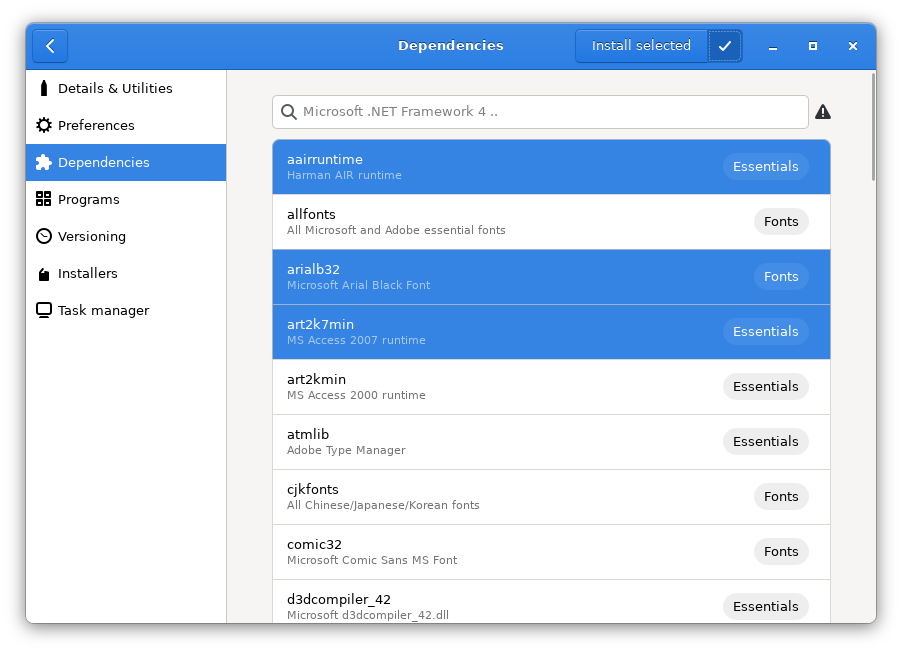

# Dependencies

Here you can extend your bottle compatibility adding new dependencies. These are Windows software and libraries installed by Bottles trough automation.

Some dependencies examples are:

* vcredist \(2013, 2015, 2019\)
* dotnet \(3.5, 3.5 sp1, 4.0, 4.7.2, 4.8\)
* dotnetcore3
* msxml \(3, 6\)
* d3dx9,
* d3compiler \(43, 46, 47\)
* ffdshow
* dirac

A new state will be generated after the dependency installation.

This is one of our most important features in Bottles. It is based on a public and community driven [repository](https://github.com/bottlesdevs/dependencies) where maintainers can propose new dependencies. [Read more](../contribute/missing-dependencies.md).

Dependencies can also automatically be installed by the official Bottles installers. So if you choose to install e.g. the epicgamestore installer, you will see the new dependencies installed after the process.
If you want to install them again, you can do it using the context menu (three dots at the right side of a dependency).

## Multiple selection

You can switch to multiselection mode using the button .

In this mode, you can select several dependencies at once and, by clicking on the "Install selected" button, install them all at once. **However, the use of this mode currently is not recommended due to possible installation problems.**

## Packing dependences 

Maintainers of dependencies can pack them, read an introduction for [packing](https://maintainers.usebottles.com/dependencies/Introduction).

