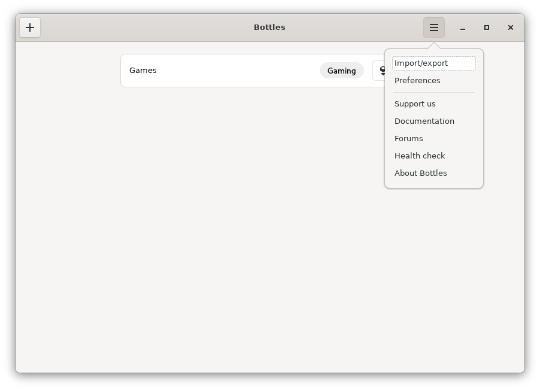
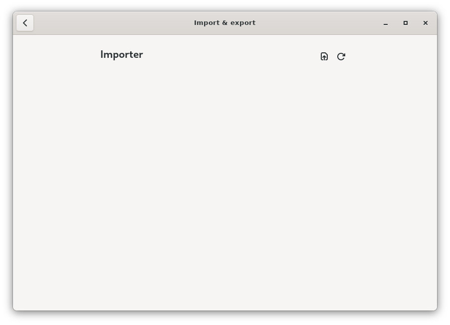

# Import from other managers

## Import from other managers

Currently we support migration from these applications:

* Bottles V1
* Lutris
* PlayOnLinux

### How to import

You can access the import tools from the Bottles main menu by selecting the "Import/export" option.

The "Importer" window will open.

Clicking on the Refresh button () will launch a search for wineprefixes available for import.

Button  allows you to import bottle backups created earlier ([Backups & Duplicate](./backups.md)).