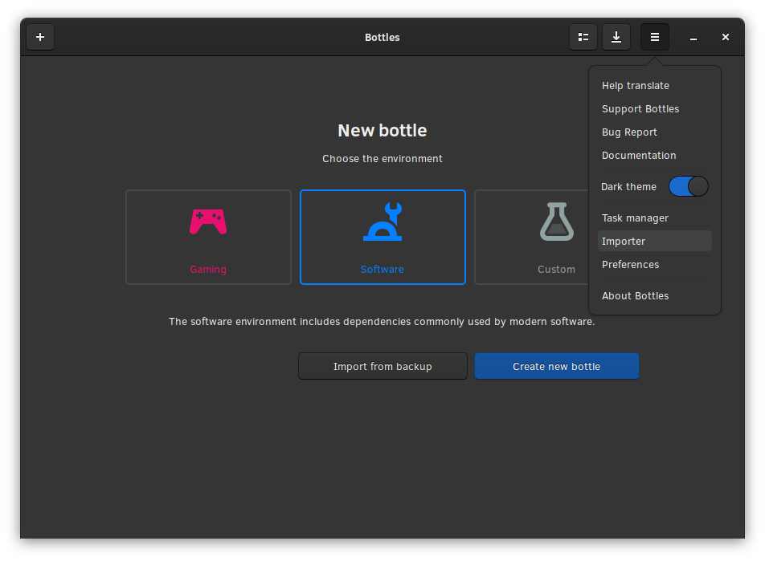

# Import from other managers


Page under construction.


## Import from other managers

Currently we support migration from these applications:

* Bottles V1
* Lutris
* PlayOnLinux

### How to import

Access the bottles menu and select "Importer"

