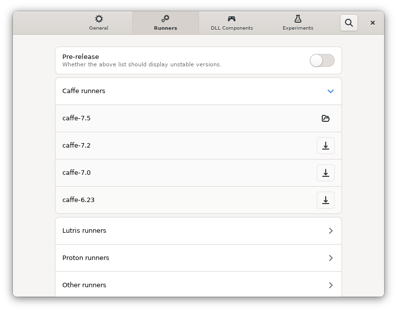

# Runners

## Types of runners

There are two types of runners in Bottles:

* Wine
* Proton

The **Wine** runner is used for all Environments and is therefore in all bottles created, but also for external prefixes imported into Bottles. We support 4 different runners:

* [Caffe](https://github.com/bottlesdevs/components/tree/main/runners/wine) (our official runner)
* Lutris (from Lutris Developers)
* Proton-GE (from [GloriousEggroll](https://github.com/GloriousEggroll))
* Vaniglia (our vanilla runner, available by default since Bottles v3)

**Caffe** is a powerful runner that came with a large set of patches and improvements for Gaming and Software.&#x20;

**Vaniglia** (Vanilla) is a clean runner as its name suggests. Apply only wine-staging patches and a modern theme created by Joshua Ashton.

The **Proton** runner (developed by [Valve](https://github.com/ValveSoftware/Proton) and improved/offered by [GloriousEggroll](https://github.com/GloriousEggroll/proton-ge-custom) in the GE custom version) is a much more complex version of Wine and is suitable for the most modern games.

It contains several patches for specific gaming titles support, implements [OpenVR](https://partner.steamgames.com/doc/features/steamvr/openvr) support and integrates dxvk (installable on wine from the bottle preferences page).

The Proton runner can be installed from the Bottles Preferences page and chosen on a bottle creation by selecting the Custom Environment. You can also switch from Wine to Proton at any time by changing your bottle preferences.


We personally recommend using the Proton runner only in special cases where there is a patch for a specific video game. However, **Valve collaborates in the development of Wine** and many of the features integrated into Proton are also available in the latest versions of Wine.


## Runner updates

You can install new runners by clicking the download button next the runner of your interest.

If you're feeling fearless, you can enable Release Candidates ("Pre-release" option) to download and then test premature versions of runners, which may include greater software compatibility at the cost of bugs and possible regressions.

### How to add unlisted runners?

Runners are installed via a community-driven Bottles [repository](https://github.com/bottlesdevs/components).

If the runner you are looking for is not present, you can add it yourself by opening a Pull Request in the repository, [providing the runner manifest](https://github.com/bottlesdevs/components/blob/main/README.md#how-to-contribute).
