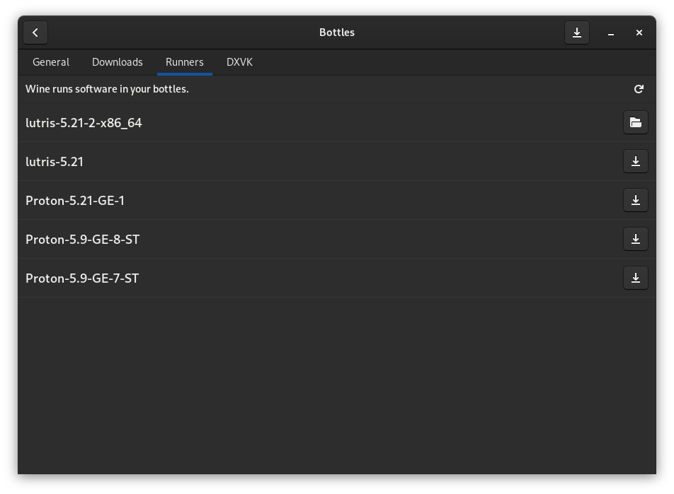

# First run

At the first start you will be prompted to download a runner \(wine\) to be ready to create bottles.

Grab a drink and have a sit, Bottles will take care of everything.

Once the download is finished \(it will take a few minutes, it is about 60 ~ 70MB\), you can create your first bottle by pressing the "+" button on the top left.

## Offline? You do not have time?

Are you offline or don't want to download it now? It 'does not matter!

If you are Offline, Bottles will notice and ask you to log in to proceed. All features that require a connection are blocked and will be active again as soon as you come back online!

You can go to the Bottles Preferences page at any time and install a runner. Alternatively, when you create a bottle, you will be taken to the installation page to download the runner.

